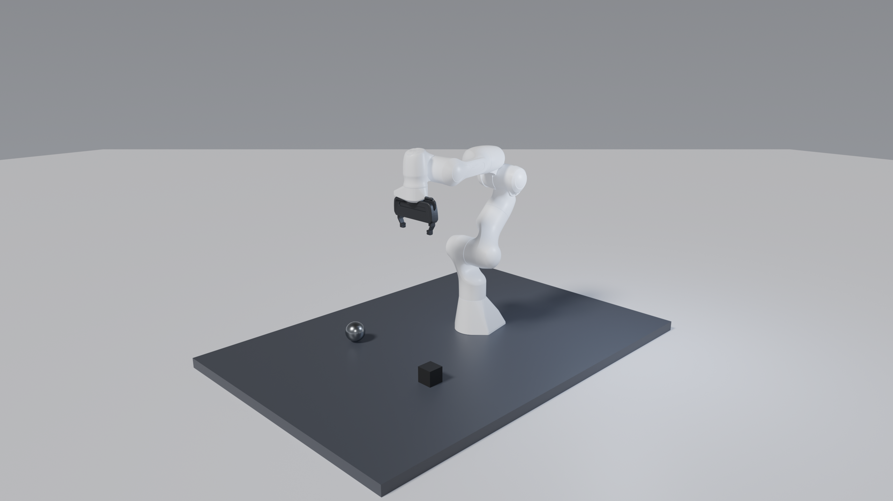

# Example: Panda on a desk

This example walks a user through the viser2blender pipeline: viser scene → bundle → cycles render — on an example scene




Files:

| | |
| --- | --- |
| [`panda_desk.py`](panda_desk.py) | the viser scene, with joint sliders, transform gizmos and the export button |
| [`panda_desk.yaml`](panda_desk.yaml) | the render config (`v2b render`) |
| `bundle_panda_desk/` | a bundle already exported from that script, so step 2 is optional |

## 1. Install

```bash
uv sync --extra cli --extra export     # from the viser2blender repo root
source .venv/bin/activate
```

The scene loads a URDF, which needs `yourdfpy` — it is in the `dev` dependency
group, installed by a plain `uv sync`. With pip: `pip install -e '.[cli]' yourdfpy`.

## 2. Configure scene and export a bundle 

```bash
python examples/panda_desk.py --urdf panda.urdf
```

Open the printed URL. Then:

- **Joint sliders** drive the arm; **Reset pose** returns to the home config.
- **Drag the gizmos** on the cube, the ball and the two lights. The directional
  key is aimed by *rotating* its gizmo; the point fill only cares where it sits,
  so its rotation handles are disabled.
- Orbit until you like the framing, then click **Export to Blender**. That
  writes `examples/out/panda_desk_<HHMMSS>/`; point the config's `bundle:` at it.

The camera in the bundle is the view your *browser* was showing, so this step is
how you compose the shot.

Any URDF whose visual meshes resolve will work — `--urdf` defaults to the Panda
in `vamp-shru`, and `package://` paths resolve against the URDF's own directory.

## 3. Render

```bash
v2b render examples/panda_desk.yaml --profile draft   # EEVEE, seconds
v2b render examples/panda_desk.yaml --profile final   # Cycles, GPU
```

Output lands in `examples/out/`, next to a `.png.yaml` provenance sidecar
recording the settings that produced it.

The shipped bundle was exported with no browser attached, so it has no camera —
`camera.auto` in the config frames the scene instead. Export from a real browser
session and that block becomes unnecessary.

## Where to go next

- Add `save_blend: true` to the config and open the `.blend` to art-direct by hand.
- `v2b init <bundle> > my.yaml` scaffolds a config for a bundle of your own.
- The full config schema is in [`../docs/config.md`](../docs/config.md); the raw
  `blender --python blender_import.py -- --bundle ...` path is in
  [`../docs/blender-flags.md`](../docs/blender-flags.md).
